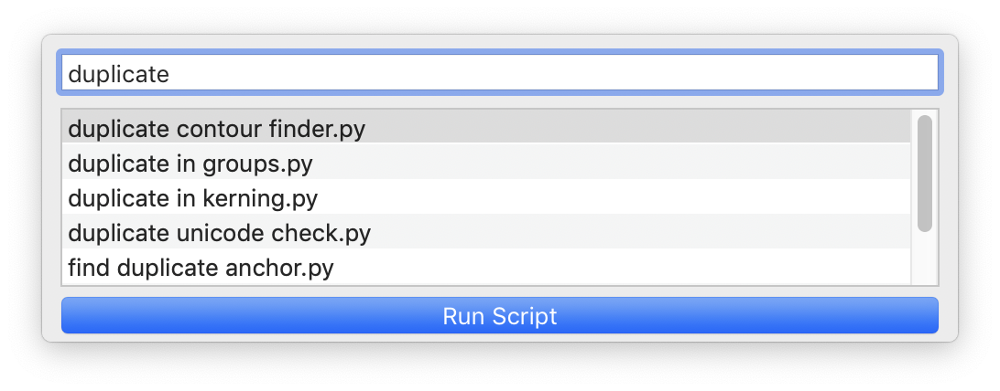
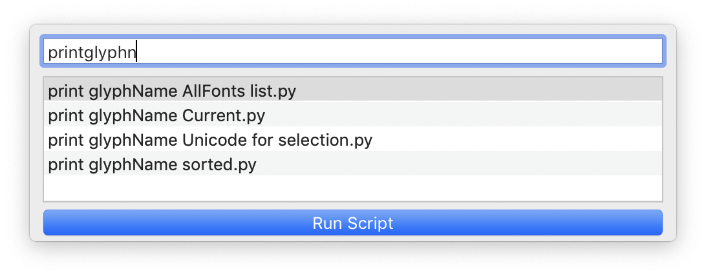

ScriptLauncher
==============

ScriptLauncher is a tool to quickly find and run scripts based on the script file name. Similar to [Alfred](https://www.alfredapp.com/) or OSX's Spotlight Search.
  
 

Usage:
------

Open the window using **Control+Option+Command+space** (mash the bottom row of your keyboard).

Advanced
--------

### Opening Script in the RoboFont Script Window

Open a selected script using **Option+Command+o**.

### Preferences

Open preferences by typing "preferences", or using **Option+Command+comma**.

-   ### Scripts/Extensions

    If you use custom locations for Scripts and Extensions, you can set
    the path here.

-   ### Search Near Open Fonts for Scripts

    ScriptLauncher will look for scripts located near your fonts. This
    is helpful if you keep project-based scripts near your fonts. The
    default is to move up 3 directories and start searching from there.
    **CAUTION:** Expanding the search area too much will cause the
    script to run slowly. You might need to fiddle with the Search Up
    setting to find the setting that works best for you.

-   ### Rememember Last Scripts

    The number of script that show up in the window.

Acknowledgements
----------------

-   Thanks to [Tal Leming](https://www.typesupply.com/) for help with
    the advanced parts (StatusInteractivePopUpWindow!), and sharing the
    name ScriptLauncher.

-   Thank you to my friends and coworkers at [Commercial
    Type](https://commercialtype.com).

-   And thank you to [David Jonathan Ross](https://www.djr.com/) for
    testing and feedback.

MIT License
-----------

Permission is hereby granted, free of charge, to any person obtaining a
copy of this software and associated documentation files (the
"Software"), to deal in the Software without restriction, including
without limitation the rights to use, copy, modify, merge, publish,
distribute, sublicense, and/or sell copies of the Software, and to
permit persons to whom the Software is furnished to do so, subject to
the following conditions:

The above copyright notice and this permission notice shall be included
in all copies or substantial portions of the Software.

THE SOFTWARE IS PROVIDED "AS IS", WITHOUT WARRANTY OF ANY KIND, EXPRESS
OR IMPLIED, INCLUDING BUT NOT LIMITED TO THE WARRANTIES OF
MERCHANTABILITY, FITNESS FOR A PARTICULAR PURPOSE AND NONINFRINGEMENT.
IN NO EVENT SHALL THE AUTHORS OR COPYRIGHT HOLDERS BE LIABLE FOR ANY
CLAIM, DAMAGES OR OTHER LIABILITY, WHETHER IN AN ACTION OF CONTRACT,
TORT OR OTHERWISE, ARISING FROM, OUT OF OR IN CONNECTION WITH THE
SOFTWARE OR THE USE OR OTHER DEALINGS IN THE SOFTWARE.
